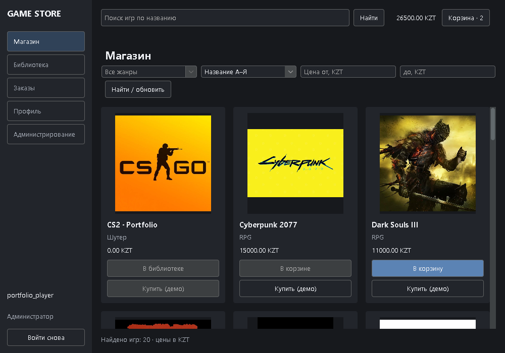

# Game Store

Учебный магазин игр для портфолио IT-стажёра. Java Swing-клиент общается с TCP-сервером; PostgreSQL хранит аккаунты, корзину, покупки и библиотеку. Оплата демонстрационная, реальные деньги и банковские данные не используются.



## Возможности

- Регистрация с обязательным email, вход по логину или email, BCrypt и серверные сессии.
- Поиск, фильтры жанра и цены, сортировка, корзина и цены в KZT.
- Учебный баланс, пополнение, транзакционная покупка и защита от повторного списания.
- Библиотека, история и детали заказов со снимками названий и цен.
- Профиль: аватар, отображаемый ник, email и смена пароля с проверкой текущего.
- Администрирование каталога с серверной проверкой роли; скрытие игр сохраняет историю.
- Графитовый интерфейс, обложки из ресурсов, фоновые сетевые операции и тайм-ауты.

## Технологии и требования

Java 17+, Swing, FlatLaf, TCP/JSON, PostgreSQL/JDBC, Flyway, BCrypt, Maven Wrapper и JUnit 5. Зависимости закреплены в [pom.xml](pom.xml); отдельно устанавливать Maven не требуется.

Нужны Git, Windows PowerShell, **JDK** 17+ (`java` и `javac` в PATH, корректный `JAVA_HOME`) и PostgreSQL 17 с утилитами `initdb`, `pg_ctl`, `psql`, `createdb`. Для первой сборки нужен интернет. Иной каталог PostgreSQL передайте через `-PgBin`.

## Установка и запуск

Первое окно PowerShell — БД, сборка и сервер:

```powershell
git clone https://github.com/ryodejo/game-store.git
Set-Location .\game-store
java -version
javac -version
Set-ExecutionPolicy -Scope Process -ExecutionPolicy Bypass
.\scripts\local-db.ps1 -Action start -PgBin 'C:\Program Files\PostgreSQL\17\bin'
. .\scripts\use-local-db.ps1
.\mvnw.cmd -B verify
java -cp .\target\game-store-1.0.0.jar gamestore.server.ServerMain
```

Скрипт создаёт отдельный кластер в игнорируемом `.local-db/`, случайный пароль и базы `gamestore` / `gamestore_test` на `127.0.0.1:55432`. Системный PostgreSQL не перенастраивается. Не удаляйте `.local-db/`: там локальные данные. Сервер автоматически применяет миграции и стартовый каталог без дубликатов.

Во втором окне перейдите в тот же клонированный каталог (путь ниже — от его родительской папки):

```powershell
Set-Location .\game-store
java -cp .\target\game-store-1.0.0.jar gamestore.client.ui.Main
```

Зарегистрируйте аккаунт, добавьте игру в корзину, пополните демонстрационный баланс в профиле и выполните учебную покупку. TCP-сервер слушает `127.0.0.1:1234`. Для остановки сервера нажмите Ctrl+C; после остановки приложений локальную БД можно остановить командой `.\scripts\local-db.ps1 -Action stop`.

## Проверки и администратор

Из корня проекта в отдельном окне:

```powershell
Set-ExecutionPolicy -Scope Process -ExecutionPolicy Bypass
. .\scripts\use-local-db.ps1
.\mvnw.cmd -B verify
```

Интеграционные тесты используют **только** `gamestore_test`, создавая случайные схемы. Без `GAMESTORE_TEST_DB_URL` проверки БД пропускаются; сборка с пропусками не подтверждает работу БД. Не направляйте тесты на рабочую базу.

После регистрации назначьте роль своему логину, затем войдите заново:

```powershell
. .\scripts\use-local-db.ps1
java -cp .\target\game-store-1.0.0.jar gamestore.server.ServerMain grant-admin your_login
```

Предустановленного пароля администратора нет. При заблокированном JAR соберите отдельно: `.\mvnw.cmd -B '-Dgamestore.build.directory=target/redesign' verify`; запускайте обе main-классы из `target/redesign/game-store-1.0.0.jar`.

## Ограничения и документация

Учебный баланс не связан с платёжными сервисами; скачивания и запуска реальных игр нет. Email не подтверждается, восстановление доступа и SMTP не реализованы. Старые аккаунты без email сохраняют вход. TCP не шифруется, приложение предназначено для локального использования. Большие каталоги требуют пагинации.

- [Настройка БД, переменные и импорт старых заказов](docs/setup.md); [.env.example](.env.example) — пример, не загружаемый автоматически.
- [Архитектура и протокол](docs/ARCHITECTURE.md).
- [Отчёт реализации](docs/VERIFICATION.md).
- [Проверка документации и запуска](docs/reproducibility.md).
