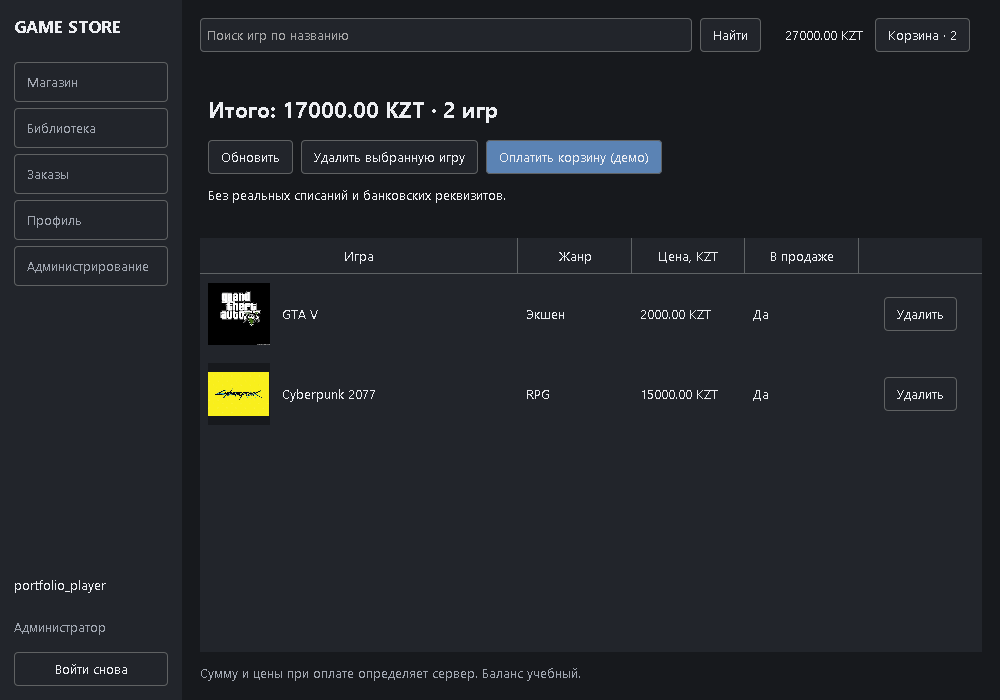
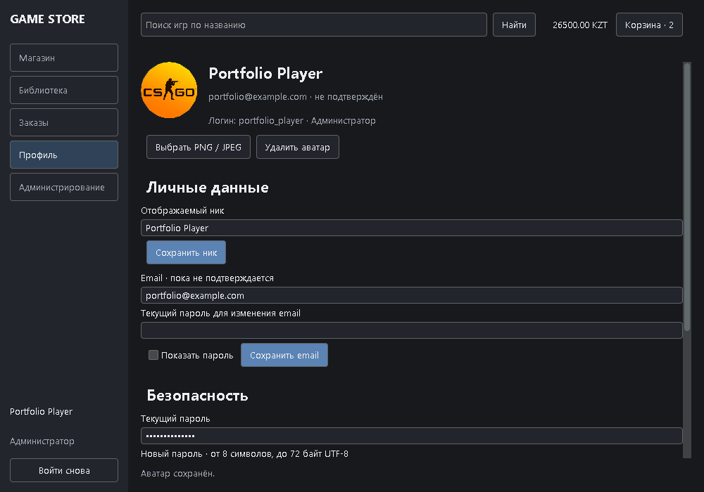
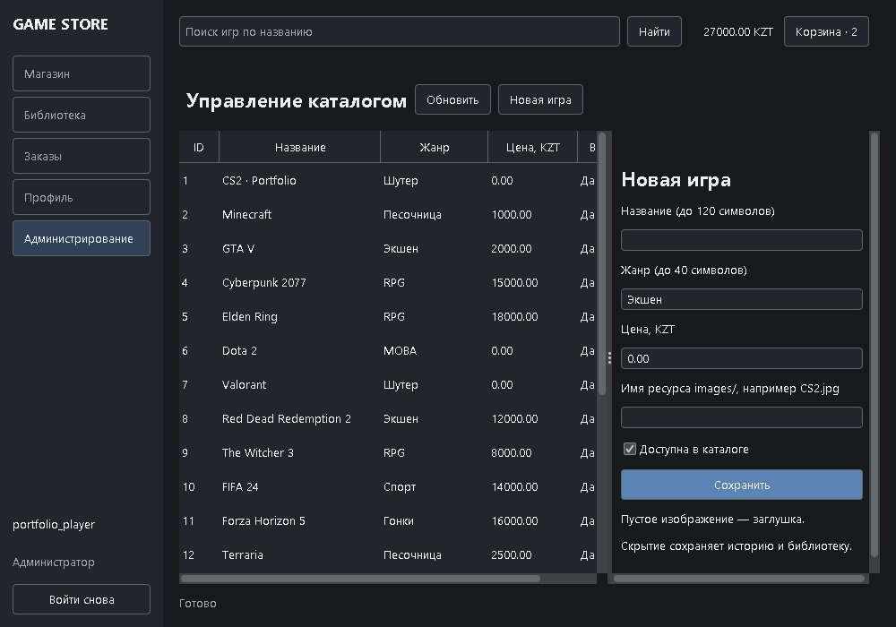

# Game Store

Учебный магазин игр для портфолио IT-стажёра: Swing-клиент, Java TCP-сервер и PostgreSQL. Проект демонстрирует JDBC, авторизацию, проверку прав, транзакции, обработку конкурентных запросов и автоматические тесты. Все покупки и пополнения демонстрационные, валюта — **KZT**.

## Возможности

- Регистрация с уникальным логином, BCrypt-хеши паролей, вход и серверная сессия на соединение.
- Вход по логину или email; отдельный отображаемый ник, email, аватар и смена пароля. Email пока не подтверждается письмом.
- Каталог из 20 исходных игр: поиск по названию, жанр, диапазон цены, сортировка по названию и цене.
- Сохраняемая корзина, удаление игр, итоговая сумма с сервера, отдельная покупка игры.
- Учебный баланс и явно обозначенное демо-пополнение. Успешные и отклонённые оплаты, UUID операций, безопасный повтор запросов.
- Библиотека, история заказов, детали с датой, статусом, играми и ценами на момент покупки.
- Администратор создаёт и редактирует игры, меняет жанр/цену и скрывает их из продажи. Скрытые игры остаются в библиотеке и истории.
- Фоновые SwingWorker-задачи для сети и изображений, тайм-ауты, заглушки обложек, восстановление входа.
- Версионируемые миграции и отдельная команда предварительного просмотра/импорта старого orders.txt.

## Стек и структура

Java 17+, Swing / FlatLaf 3.6.1, TCP/UTF-8 JSON Lines, PostgreSQL 17, JDBC, Flyway, BCrypt, Gson, Maven Wrapper, JUnit 5. Код компилируется с `--release 17`; фактическая проверка в этом окружении выполнена на Temurin JDK 25.

```text
src/main/java/gamestore/
  shared/           DTO и описание TCP-формата
  server/           JDBC, сервисы, транзакции, TCP-сессии, CLI импорта
  client/           TCP-клиент без доступа к БД
  client/ui/        Swing-экраны и фоновые задачи
src/main/resources/db/migration/  SQL-миграции
src/test/java/      проверки БД, покупок, протокола, импорта и Swing
images/            существующие обложки, включаются в JAR как /images/*
scripts/           отдельный локальный PostgreSQL для Windows
docs/              архитектура, протокол и результаты проверки
legacy/            локальная резервная копия исходной версии (игнорируется Git)
orders.txt         оригинальные данные заказов (не изменяются, игнорируются Git)
```

Старые Java/class-файлы сохранены в `legacy/`, чтобы случайно не запустить старый небезопасный сервер командой `java ServerMain`. Maven собирает только `src/`. Существующие пользователи прежней версии не сохранялись на диске: восстановить логины/пароли из orders.txt невозможно. Новые аккаунты хранятся в PostgreSQL. Предустановленных аккаунтов и паролей администратора нет.

### VS Code и резервная версия

Открывайте в VS Code именно папку `game.proj`, содержащую `pom.xml` и `.vscode/settings.json`. Maven явно использует `src/main/java` и `src/test/java`; расширение Java импортирует его конфигурацию автоматически. `java.project.sourcePaths` задаёт те же каталоги только для резервного режима без импортированного Maven-проекта.

`legacy/` исключена из Java-импорта, обновления ресурсов Java Language Server, сканирования Maven и поиска. При открытии её `.java` файлы показываются как обычный текст, чтобы диагностика резервной версии не попадала в Problems. Содержимое резервной папки не изменяется; она остаётся доступной в проводнике.

После применения настроек выполните `Java: Clean Java Language Server Workspace` из палитры команд VS Code и согласитесь на перезапуск сервера языка, если видите оставшиеся старые сообщения. Для основной версии зависимости и тесты определяются Maven; запускать компиляцию всех Java-файлов рекурсивно от корня проекта не нужно.

Если Windows блокирует `target/game-store-1.0.0.jar` запущенным сервером или клиентом, остановите собственное приложение перед обычной чистой сборкой. Можно проверить изменения, сохраняя запущенное приложение, в отдельном каталоге: `.\mvnw.cmd -B '-Dgamestore.build.directory=target/verification' clean verify`. Новый JAR и отчёты окажутся в `target/verification/`; уже запущенное приложение продолжит использовать прежнюю версию до перезапуска.

Актуальный JAR с редактированием профиля — **`target/game-store-1.0.0.jar`**. Если Windows блокирует этот файл, используйте отдельную сборку `.\mvnw.cmd -B '-Dgamestore.build.directory=target/redesign' verify` и замените путь JAR в командах запуска на `target/redesign/game-store-1.0.0.jar`. Для обновления приложения остановите прежний сервер через `Ctrl+C` и закройте прежний клиент; перезапустите оба из нового JAR.

## Требования

- Windows PowerShell 5.1+ или PowerShell 7.
- JDK 17 или новее: `java -version` и `javac -version` должны работать.
- PostgreSQL 17: для локального сценария нужны `initdb.exe`, `pg_ctl.exe`, `psql.exe`, `createdb.exe` в одном каталоге bin.
- Доступ к Maven Central при первой сборке. Maven отдельно устанавливать не требуется: `mvnw.cmd` загружает закреплённую версию с проверкой SHA-256.
- Графическая сессия Windows для запуска Swing-клиента. Автотесты Swing работают без открытия окон.

## Быстрый запуск в Windows PowerShell

Откройте PowerShell в папке проекта:

```powershell
Set-Location 'C:\Users\nurma\OneDrive\Рабочий стол\game.proj'
java -version
javac -version
.\scripts\local-db.ps1
. .\scripts\use-local-db.ps1
.\mvnw.cmd -B verify
java -cp .\target\game-store-1.0.0.jar gamestore.server.ServerMain
```

Скрипт создаёт собственный кластер в `.local-db/data`, базы `gamestore` и `gamestore_test`, случайный пароль и запускает PostgreSQL на **127.0.0.1:55432**. Существующий сервис PostgreSQL, его конфигурация и базы не меняются. Повторный запуск использует тот же кластер и пароль. Секрет лежит только в игнорируемом `.local-db/connection.json`; не публикуйте эту папку. Сервер по умолчанию слушает **127.0.0.1:1234**.

Если PostgreSQL находится в другом каталоге:

```powershell
.\scripts\local-db.ps1 -PgBin 'D:\PostgreSQL\17\bin'
```

Во втором окне PowerShell запустите клиент; параметры БД ему не нужны:

```powershell
Set-Location 'C:\Users\nurma\OneDrive\Рабочий стол\game.proj'
java -cp .\target\game-store-1.0.0.jar gamestore.client.ui.Main
```

Зарегистрируйтесь, войдите, откройте «Профиль» и нажмите «Пополнить демо-баланс». В магазине добавьте игры в корзину или воспользуйтесь «Купить (демо)». Оплатите корзину и проверьте разделы «Библиотека» и «Заказы».

## Интерфейс

Графитовая тема: фон `#17191D`, панели `#22252B`, текст `#ECEEF2`, вторичный текст `#A0A6B0`, акцент `#5B83B4`. Шрифт Segoe UI; оформление полей, таблиц, диалогов и состояний фокуса обеспечивает FlatLaf ([настройка темы](https://www.formdev.com/flatlaf/customizing/)).

Слева расположены магазин, библиотека, заказы и профиль; администрирование видно только администраторам. Сверху — поиск по названию, учебный баланс и корзина с количеством игр. Сетка подстраивает число колонок под ширину окна. Исходные обложки показываются целиком с сохранением пропорций; отсутствующее изображение заменяется нейтральной заглушкой. В корзине доступны миниатюры и удаление в строках. Ошибки отображаются внутри экрана, а длительные операции — индикатором загрузки. Сеть и чтение изображений выполняются в SwingWorker.

Минимальный размер основного окна — 1000×700. Для проверки увеличенного масштаба можно запустить клиент с `java '-Dflatlaf.uiScale=150%' -cp .\target\game-store-1.0.0.jar gamestore.client.ui.Main`; обычный запуск использует масштаб окружения Windows. Изменение масштаба JVM не меняет настройки Windows.

Снимки актуальных экранов: [вход](docs/screenshots/login.png), [магазин](docs/screenshots/catalog.png), [корзина](docs/screenshots/cart.png), [библиотека](docs/screenshots/library.png), [заказы](docs/screenshots/orders.png), [профиль](docs/screenshots/profile.png), [администрирование](docs/screenshots/admin.png). Заполненные экраны получены UI-тестом на отдельной схеме базы, окно входа — в графической сессии Windows.

Остановить сервер: `Ctrl+C`. После остановки сервера отдельный PostgreSQL можно остановить командой:

```powershell
.\scripts\local-db.ps1 -Action stop
```

Ничего не удаляется; для следующего запуска снова выполните `local-db.ps1`.

## Редактирование профиля

В разделе «Профиль» доступны аватар, ник, email и отдельная форма смены пароля. Логин для входа неизменяемый: покупки, баланс, роль и библиотека привязаны к тому же ID пользователя. Ник — 3–30 Unicode-символов после обрезки пробелов, без управляющих символов. Первоначальный ник берётся из логина, но ограничивается 30 символами; существующие логины длиной 31–32 сохраняются полностью и продолжают работать для входа.

Email обязателен при новой регистрации: проверка выполняется сервером и PostgreSQL. Существующие аккаунты без email продолжают входить по логину и могут добавить адрес в профиле с проверкой текущего пароля. Адрес нормализуется обрезкой внешних пробелов и приведением **всего адреса** к нижнему регистру через `Locale.ROOT`; нормализованный адрес уникален в PostgreSQL. Поддерживаются адреса с ASCII-символами и доменом с точкой; провайдерские правила для точек и `+alias` не применяются. Вход по email определяется наличием `@`; этот символ запрещён в логине, поэтому неоднозначности нет. Смена email требует текущего пароля.

Email всегда считается **неподтверждённым**: письма не отправляются, подтверждение и восстановление пароля не реализованы, внешние почтовые сервисы не подключены. Интерфейс не сообщает о вымышленной отправке письма.

`V5__mandatory_registration_email.sql` требует email для новых пользователей и запрещает удаление уже указанного адреса. Старые аккаунты без email, их пароли, роли, баланс, аватары и покупки сохраняются. SMTP, кнопка восстановления и команды сброса через email отсутствуют; пароль меняется в профиле с проверкой текущего пароля.

Смена пароля проверяет текущий пароль, совпадение новых паролей, минимум 8 Unicode-символов и максимум 72 **байта UTF-8**. Пароль хранится только как BCrypt-хеш; хеш не передаётся клиенту. После успешной смены сервер увеличивает версию сессий в БД, все прежние подключения получают `UNAUTHORIZED` при следующей команде. Для продолжения нажмите «Войти снова» и используйте новый пароль.

Аватар выбирается из локального PNG/JPEG размером до **2 МиБ (2097152 байта)**. Изображение по центру кадрируется в квадрат; до сохранения показывается круглый предпросмотр с возможностью отмены. Сервер независимо проверяет содержимое, размер файла и размеры изображения: 32–4096 пикселей по каждой стороне, максимум 16 млн пикселей. Сервер сохраняет только заново закодированный PNG **256×256** в `users.avatar_png` (`BYTEA`), без исходного пути и метаданных. Удаление возвращает круг с инициалами. Чтение файла, обработка изображения и запросы выполняются вне Swing EDT.

## Подключение к существующему PostgreSQL

Можно использовать свой PostgreSQL вместо отдельного кластера. Создайте только новые роль и базы проекта. Например, откройте psql:

```powershell
& 'C:\Program Files\PostgreSQL\17\bin\psql.exe' -h localhost -U postgres -d postgres -W
```

В psql задайте пароль интерактивно, без помещения его в файл или историю команды:

```sql
CREATE ROLE gamestore_app LOGIN;
\password gamestore_app
CREATE DATABASE gamestore OWNER gamestore_app;
CREATE DATABASE gamestore_test OWNER gamestore_app;
\q
```

Если имя уже занято, используйте другое имя новой базы/роли. Не удаляйте существующие базы. В PowerShell задайте параметры только для текущего процесса:

```powershell
$env:GAMESTORE_DB_URL = 'jdbc:postgresql://localhost:5432/gamestore'
$env:GAMESTORE_DB_USER = 'gamestore_app'
$env:GAMESTORE_DB_PASSWORD = [System.Net.NetworkCredential]::new('', (Read-Host 'Пароль БД' -AsSecureString)).Password
$env:GAMESTORE_TEST_DB_URL = 'jdbc:postgresql://localhost:5432/gamestore_test'
.\mvnw.cmd -B verify
java -cp .\target\game-store-1.0.0.jar gamestore.server.ServerMain
```

`.env.example` — справочный шаблон, автоматически не загружается. Приложение читает переменные окружения. `GAMESTORE_HOST`/`GAMESTORE_PORT` задают адрес TCP для сервера и клиента; по умолчанию достаточно ничего не менять. Администратор ОС/БД управляет доступом к параметрам подключения.

## Миграции

Сервер и его CLI применяют Flyway-миграции до начала работы. `V1__schema.sql` создаёт таблицы пользователей, ролей, игр, корзины, заказов/позиций, оплат, библиотеки, демо-пополнений и учёта импорта. `V2__catalog.sql` переносит исходные 20 игр с прежними ID и изображениями. `V3__user_profile.sql` добавляет ник, уникальный необязательный email, флаг неподтверждённого email, аватар и версию сессий. `V4__strict_display_name_length.sql` ограничивает первоначальный ник старых длинных логинов 30 символами и закрепляет строгий предел в БД; контрольная сумма уже применённой V3 не меняется. Старые логины, BCrypt-хеши, роли, баланс и связи покупок сохраняются. Каталог не дублируется при перезапусках.

Отдельный запуск миграций:

```powershell
. .\scripts\use-local-db.ps1
java -cp .\target\game-store-1.0.0.jar gamestore.server.ServerMain migrate
```

Применённые SQL-файлы не редактируйте: последующие изменения оформляются как `V3__...sql` и т.д. Flyway проверяет контрольные суммы; очистка схем через Flyway отключена.

## Назначение администратора

Сначала зарегистрируйте собственный аккаунт через клиент. Затем в PowerShell с параметрами БД выполните, заменив `my_login` своим логином:

```powershell
. .\scripts\use-local-db.ps1
java -cp .\target\game-store-1.0.0.jar gamestore.server.ServerMain grant-admin my_login
```

Перезапустите клиент и войдите снова, чтобы появилась вкладка «Администрирование». Назначение роли доступно только локальному CLI владельца подключения к БД; TCP-команды назначения роли нет. Сервер проверяет актуальную роль на каждом административном запросе, даже если клиент подделывает интерфейс.

Для новой обложки добавьте файл в `images/`, укажите только его имя в редакторе и пересоберите JAR. Отсутствующий или неподдерживаемый файл заменяется заглушкой.

## Как устроена учебная оплата

Регистрация создаёт баланс **0.00 KZT**. Демо-пополнение принимает от 0.01 до 100000.00 KZT на операцию; оно не связано с банком. Номера карт, CVV и банковские реквизиты нигде не запрашиваются.

При покупке сервер блокирует пользователя и нужные игры, проверяет библиотеку, берёт актуальные цены из БД, сохраняет заказ и снимки названий/цен. При достаточном балансе в **одной транзакции** выполняются списание, успешная попытка оплаты, добавление в библиотеку и очистка корзины. Отдельная покупка убирает из корзины только купленную игру. Исключение откатывает все изменения.

Недостаточный баланс создаёт заказ `DECLINED` и попытку `DECLINED`; баланс и корзина сохраняются. Повтор UUID возвращает прежний результат, включая прежний результат отказа. После пополнения новая попытка покупки должна получить новый UUID. Один UUID нельзя использовать для другого пользователя или другой отдельной игры.

Параллельные изменения одного аккаунта сериализуются блокировкой строки пользователя. Уникальность `(user_id, game_id)` в библиотеке и ограничения денежных значений дополнительно защищают данные. Пополнения также идемпотентны по UUID и сумме.

При обрыве связи во время оплаты интерфейс сохраняет UUID в текущем сеансе приложения. Нажмите «Войти снова», затем «Повторить ту же оплату». Идемпотентность хранится в БД и переживает перезапуск сервера. Если полностью закрыли клиент, сначала проверьте библиотеку и историю: локальный незавершённый запрос между запусками клиента не сохраняется.

## Старый orders.txt

Оригинальный файл сохранён без изменений. Формат `User 3 bought game 2` не содержит логинов, времени или оплаченной цены. Автоматически приписывать эти строки новому аккаунту небезопасно. Сначала создайте новый аккаунт и явно сопоставьте старый ID с его логином.

Предпросмотр для старого пользователя 3:

```powershell
. .\scripts\use-local-db.ps1
java -cp .\target\game-store-1.0.0.jar gamestore.server.ServerMain import-orders .\orders.txt 3 my_login
```

Применение после проверки сопоставления:

```powershell
java -cp .\target\game-store-1.0.0.jar gamestore.server.ServerMain import-orders .\orders.txt 3 my_login --apply --ack-reconstructed
```

Заказы получают статус `IMPORTED` и источник `LEGACY`. Цена берётся на момент импорта, дата — дата импорта; интерфейс прямо обозначает отсутствие исторических сведений. Списаний и попыток оплаты не создаётся. Повторяющиеся строки сохраняются как отдельные старые заказы, библиотека не дублируется. Невалидная строка или неизвестная исходная игра отменяет весь импорт.

Повтор **того же содержимого файла и старого ID** не создаёт новые заказы; другое сопоставление после импорта запрещено. Не редактируйте файл между повторами: изменённое содержимое считается другим источником. Для каждого старого пользователя команда вызывается отдельно. Исходные предустановленные аккаунты с известными паролями не переносятся.

## Проверки

```powershell
. .\scripts\use-local-db.ps1
.\mvnw.cmd -B verify
```

Тесты проверяют реальные JDBC-транзакции на PostgreSQL и обмен TCP, а также Swing без открытия окон. Для каждого набора создаётся уникальная временная схема в `gamestore_test`; удаляется только эта схема. Рабочие таблицы и существующие базы не очищаются. Без `GAMESTORE_TEST_DB_URL` интеграционные тесты отмечаются **Skipped**, а не выдаются за успешные.

Покрыты регистрация/дубликаты, правильный/неправильный пароль, перезапуск сервера, поиск/фильтры/корзина, успешная и отклонённая покупка, бесплатная игра, запрет повторной покупки, повтор UUID, конкурентные операции, откат после ошибки после списания, доступ к чужим заказам, права администратора, импорт и повреждённые TCP-кадры. Отдельно проверены все 20 ресурсов обложек, заглушка, свободный EDT при долгой операции и действия экранов через настоящий TCP.

Отчёты: `target/surefire-reports/`. Снимки Swing после интеграционного теста: `target/ui-previews/populated/`. Итоги текущей проверки — [docs/VERIFICATION.md](docs/VERIFICATION.md).

## Ограничения и устранение проблем

- Это локальный учебный проект: нет реальных платежей, скачивания игр и TLS. Для удалённого использования потребуется отдельная защита транспорта. По умолчанию сервер привязан к loopback.
- Корзина — до 100 игр, выдача каталога/библиотеки — до 1000, история — последние 200 заказов. Для большего объёма нужна пагинация.
- Баланс ограничен `NUMERIC(14,2)`. Корзина показывает текущие цены; при оплате сервер заново определяет сумму и возвращает фактически сохранённые цены.
- Нет восстановления пароля, почты и нескольких единиц одной цифровой игры. Проверка прав всегда выполняется сервером.
- Если `java` не найдена, укажите полный путь к `java.exe` установленного JDK либо задайте `JAVA_HOME` и PATH только в текущем окне PowerShell. Проверенный путь в этом окружении: `C:\Users\nurma\AppData\Local\Programs\Eclipse Adoptium\jdk-25.0.2.10-hotspot`.
- Если PowerShell запрещает локальные сценарии, откройте временную оболочку командой `powershell.exe -NoProfile -ExecutionPolicy Bypass`, затем повторите команды быстрого запуска в ней. Это не меняет глобальную политику выполнения.
- Если занят порт 55432, не останавливайте чужой PostgreSQL. Подключитесь к отдельной новой базе существующего сервера по инструкции выше. TCP-порт можно сменить через `$env:GAMESTORE_PORT = '1235'` в обоих окнах.
- При недоступном TCP-сервере клиент покажет сообщение после тайм-аута; проверьте окно сервера и одинаковые HOST/PORT. Подключение: 4 секунды; ответ: 20 секунд; неактивная серверная сессия: 5 минут.
- Предупреждения Maven о native access/Unsafe на JDK 25 относятся к Maven и не означают провал сборки; результат определяют exit code и отчёт тестов.

## Скриншоты

Снимки получены из Swing на тестовых данных через настоящий TCP и PostgreSQL:






Подробности реализации: [архитектура и протокол](docs/ARCHITECTURE.md).
