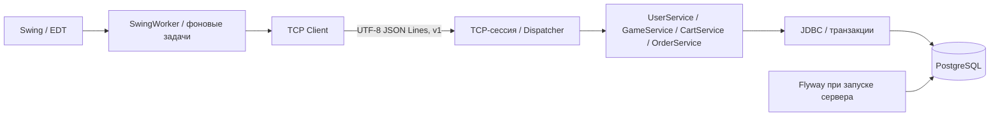

# Архитектура и TCP-протокол



Клиент импортирует только shared-модели и TCP-код. Доступ к БД есть только в серверном пакете. Соединение TCP обслуживается отдельным Dispatcher с собственными userId и sessionVersion; их устанавливает только успешный LOGIN. Версия проверяется по БД перед каждой командой авторизованной сессии. Смена пароля увеличивает users.session_version, прежние сессии получают UNAUTHORIZED при следующей команде. Уже принятые запросы могут завершить обработку. Ошибочный LOGIN сбрасывает прежнюю авторизацию. После разрыва соединения требуется новый вход.

Сервер имеет 16 обработчиков и очередь из 32 соединений. Каждое принятое соединение и каждый JDBC-ресурс закрываются. Остановка закрывает listener и клиентские сокеты, прерывает пул. Закрытие клиента прерывает блокирующее чтение без ожидания EDT. JDBC ограничивает время подключения, ожидание блокировок и SQL-запросов.

## Формат

Один JSON-объект на строку, UTF-8, окончание LF; ровно один ответ на запрос. Обычный запрос — не более 16384 символов; только SET_AVATAR допускает до 2800000 символов для base64 файла до 2 МиБ. Ответ — не более 1048576 символов. Серверное чтение ограничено общим пределом 2800000; кадры больше обычного предела разрешаются только для SET_AVATAR. Чрезмерный кадр получает FRAME_TOO_LARGE и соединение закрывается; обрыв посреди кадра закрывает сессию. Повреждённый завершённый JSON получает BAD_REQUEST, после него можно продолжить работу. Глубина JSON ограничена 16.

```json
{"version":1,"command":"CATALOG","args":{"search":"Minecraft","sort":"PRICE_ASC"}}
```

```json
{"version":1,"ok":true,"code":"OK","message":"Готово","data":[]}
```

```json
{"version":1,"ok":false,"code":"UNAUTHORIZED","message":"Войдите в аккаунт.","data":null}
```

Денежные аргументы передаются строками десятичного формата с точкой. Ответы содержат BigDecimal как JSON-числа. Клиент не передаёт цены или сумму при покупке.

| Команда | Аргументы | Доступ |
|---|---|---|
| REGISTER | login, password, email | Без входа, обязательный email; всегда создаёт CUSTOMER |
| LOGIN | login, password | Без входа; поле login принимает логин или email |
| CATALOG | search?, genre?, min?, max?, sort? | Без входа; только active |
| PROFILE, CART, ORDERS, LIBRARY, LOGOUT | нет | Своя сессия |
| UPDATE_NAME | displayName | Своя сессия |
| UPDATE_EMAIL | email, currentPassword | Своя сессия + текущий пароль |
| CHANGE_PASSWORD | currentPassword, newPassword, repeatPassword | Своя сессия + текущий пароль; завершает все прежние сессии |
| AVATAR, REMOVE_AVATAR | нет | Своя сессия |
| SET_AVATAR | image (base64 PNG/JPEG) | Своя сессия; независимая проверка и обработка на сервере |
| ADD_CART, REMOVE_CART | gameId | Своя сессия |
| BUY | gameId, operationId | Своя сессия |
| CHECKOUT | operationId | Своя сессия |
| TOP_UP | amount, operationId | Своя сессия, только демо |
| ORDER_DETAIL | orderId | Своя сессия + владелец заказа в SQL |
| ADMIN_GAMES | нет | Актуальная роль ADMIN из БД |
| ADMIN_SAVE | id, title, genre, price, image, active | Актуальная роль ADMIN из БД; id=0 — создание |

Сортировки: TITLE, PRICE_ASC, PRICE_DESC. Неизвестные поля запрещены, в том числе userId/user_id. ID пользователя выбирает сервер из сессии. ORDER_DETAIL проверяет владельца даже для администратора. Запросы SQL параметризованы; ORDER BY выбирается из фиксированного списка.

Основные ошибки: VALIDATION, LOGIN_TAKEN, BAD_CREDENTIALS, UNAUTHORIZED, FORBIDDEN, NOT_FOUND, NOT_FOR_SALE, CART_EMPTY, ALREADY_OWNED, OPERATION_CONFLICT, DATABASE, BAD_REQUEST, VERSION, UNKNOWN_COMMAND, FRAME_TOO_LARGE. SQL-текст, пароль и stack trace клиенту не возвращаются. Пароли и полные входящие запросы не логируются.

Ошибки профиля: NICK_INVALID, EMAIL_INVALID, EMAIL_TAKEN, CURRENT_PASSWORD, PASSWORD_MISMATCH, AVATAR_INVALID. User DTO содержит только id, login, role, balance, displayName, email и emailVerified; ни BCrypt-хеш, ни версия сессии клиенту не передаются. Аватар запрашивается отдельно командой AVATAR и возвращается как base64 обработанного PNG (пустая строка — аватара нет).

Email нормализуется через strip и toLowerCase(Locale.ROOT), уникальность обеспечивает PostgreSQL. Логины не содержат @, поэтому маршрут входа однозначен. Email не подтверждается и не используется для восстановления пароля. Смена email и пароля блокирует строку пользователя FOR UPDATE и проверяет актуальный BCrypt-хеш в транзакции. Изменения профиля не затрагивают идентификатор пользователя и связи заказов/библиотеки.

Начиная с V5 email обязателен при регистрации. Сервер отклоняет отсутствующий, пустой и некорректный адрес; триггер PostgreSQL запрещает INSERT с NULL email и удаление ранее указанного адреса. Старые строки с NULL email не изменяются: вход, обновление ника/аватара, покупки и смена пароля продолжают работать. SMTP и команды восстановления доступа не добавлены.

AvatarImages проверяет действительный формат через ImageIO reader, ограничивает вход 2 МиБ и размеры до 4096 по стороне / 16 млн пикселей до декодирования. Изображение кадрируется по центру, преобразуется в 256×256 и заново кодируется в PNG. В BYTEA хранятся только обработанные пиксели; путь и метаданные не сохраняются. Клиент выполняет ту же обработку лишь для предпросмотра; окончательное решение принимает сервер.

## Транзакция покупки

1. SELECT пользователя FOR UPDATE: все изменения корзины, баланса и библиотеки одного аккаунта получают одну и ту же блокировку.
2. Поиск сохранённой попытки по UUID. Повтор возвращает сохранённый результат; другой пользователь/тип покупки/игра получает OPERATION_CONFLICT.
3. Чтение игр FOR SHARE в порядке ID, проверка active и владения, расчёт суммы BigDecimal.
4. Заказ PENDING и снимки позиций. Если денег достаточно — списание, библиотека и удаление купленных позиций корзины; иначе баланс и корзина остаются.
5. Финальный статус заказа PAID/DECLINED, попытка SUCCEEDED/DECLINED, сохранение balance_after, COMMIT.

Исключение на любом шаге вызывает ROLLBACK. В БД остаются только завершённые транзакции. Отказ по балансу является сохранённым бизнес-результатом, а не исключением; его повтор с тем же UUID не превращается в успешную покупку после пополнения. Пополнение имеет отдельный журнал идемпотентности с проверкой суммы.

Таблицы используют PK/FK, уникальные логины/UUID, составные связи владельца заказа и ограничения диапазона NUMERIC. Название и цена в order_items независимы от редактирования games. Игры скрываются через active, физическое удаление API не предоставляет.

## Устройство тестов

Интеграционные тесты требуют GAMESTORE_TEST_DB_URL и создают схему gs_test_<случайный UUID>. Flyway разворачивает настоящую схему PostgreSQL; проверки используют реальные блокировки, SQL-ограничения, TCP-сокеты и серверные сессии. После набора удаляется только созданная схема. Конкурентные тесты используют barrier, а не искусственные последовательные вызовы.

Откат проверяется временным PostgreSQL-триггером, который отклоняет добавление в библиотеку после списания: затем проверяются баланс, корзина, заказы, попытки оплаты и повтор исходного UUID. Триггер существует только внутри временной тестовой схемы.

Swing-тесты проверяют работу вне EDT и обновления на EDT. Интеграционный тест экранов выполняет поиск, добавление/удаление корзины, чтение деталей и административное редактирование через живой TCP-сервер; снимки формируются самим Swing без внешней генерации изображений.
